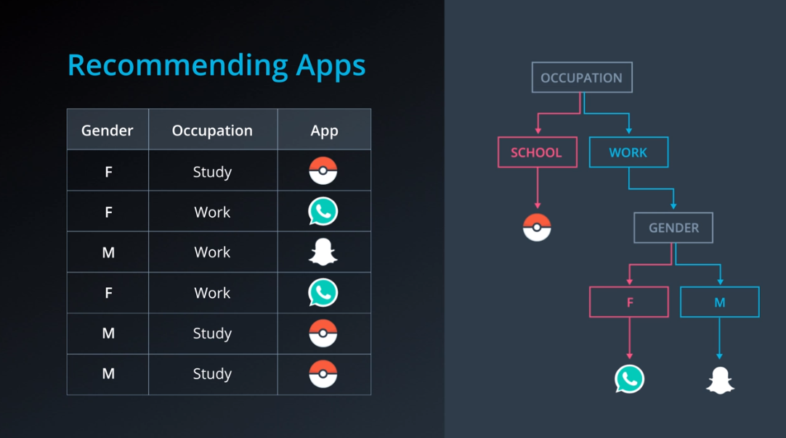
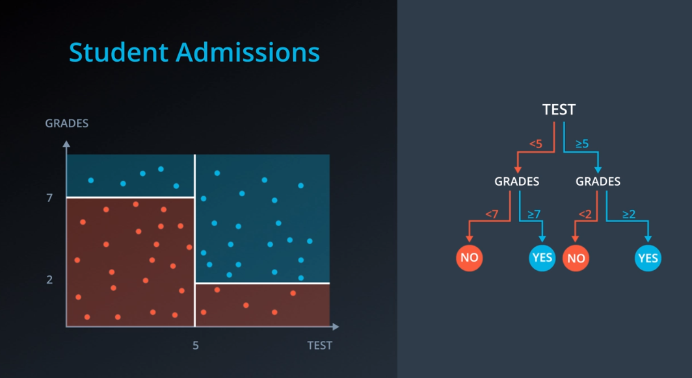

# Decision Trees

A decision tree is a decision support tool that uses a tree-like model of decisions and their possible consequences, including chance event outcomes, resource costs, and utilityA decision tree is a decision support tool that uses a tree-like model of decisions and their possible consequences, including chance event outcomes, resource costs, and utility.

### Categorical features

### Continuos features

## Entropy

**Entropy** is about how many ways the particles can be arranged to match a macrostate- temperature etc. The more the number of ways there are to arrange the particles to match the macrostate-the higher the **probability** of the change occuring. **Entropy** is about how many ways the particles can be arranged to match a macrostate- temperature etc. The more the number of ways there are to arrange the particles to match the macrostate-the higher the **probability** of the change occuring.

### Formula

$$
entropy = -\frac{m}{(m+n)} log_2(\frac{m}{m+n})-\frac{n}{(m+n)} log_2(\frac{n}{m+n})
$$

We can state this in terms of probabilities instead for the number of red balls as p_1p1 and the number of blue balls as p_2p2:

---

$$
p_1 = \frac{m}{m+n}
$$

---

$$
p_2 = \frac{n}{m+n}
$$

---

$$
entropy = -p_1 log_2(p_1) - p_2 log_2(p_2)
$$

This entropy equation can be extended to the multi-class case, where we have three or more possible values:

$$
entropy = -p_1 log_2(p_1) - p_2 log_2(p_2) - ... - p_n log_2(p_n)= - \sum_{i=1}^n p_i log_2(p_i)
$$

## Information Gain

The information gain is the difference between the entropy of the parent and the average entropy of the childern

$$
Information Gain = Entropy(Parent) - (\frac{m}{m+n}Entropy(Child1) + \frac{n}{m+n} Entropy(Child2))
$$

https://github.com/udacity/DSND_Term1https://github.com/udacity/DSND_Term1
