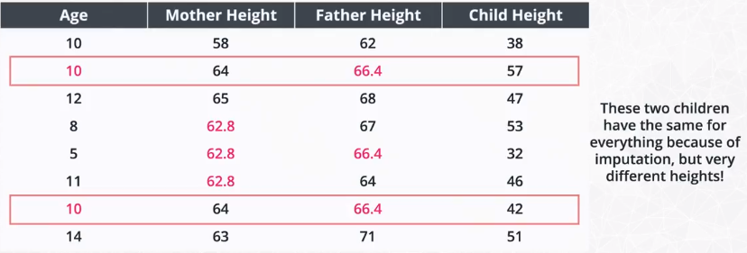

# CRISP-DM

Cross-Industry Standard Process for Data Mining

Phases:

1. Business Understanding
2. Data Understanding
3. Data Preparation
4. Modeling
5. Evaluation
6. Deployment

## 1. Business Understanding

This means understaing the problem and questions you are interested in tackling in the context of whatever domain you're working in. Examples include:

* How do we acquire new customers?
* Does a new treatment perform better than an existing treatment?
* How can improve communication
* How can we imporove travel?
* How can we better retain information

**Business Questions**

1. How do I break into the field
2. What are the placement and salaries of those who attended a coding bootcamp?
3. How well can we predict an individual's salary? What aspects correlate well to salary?
4. How well can we predict an individual's job satisfaction? What aspects correlate well to job satisfaction?

## 2. Data Understanding

We need to move the question from **Business Understanding** to data. We need data that can be used to answer the questions, or collect data to get at our questions of interest

#### What Should you check?

* [ ] Check each column is a variable, and each row is an individual.
* [ ] Look at the number of rows and columns in the dataset
* [ ] Check if there are missing values in any of the rows or columns
* [ ] Check if any column are of different data types than you would expect (ex: numbers showing as strings)
* [ ] Build exploratory plots like bar chart, histograms, and scatterplots to better understand the data

## 3. Prepare Data

### Working with missing values

There are two main 'pain' points for passing data to machine learning models in sklearn:

1. Missing Values
2. Categorical Values

Sklearn does not know how you want to treat missing values or categorical variables, and there are lots of methods for working with each. For this lesson, we will look at common, quick fixes. These methods help you get your models into production quickly, but thoughtful treatment of missing values and categorical variables should be done to remove bias and improve predictions over time.

Three strategies for working with missing values include:

1. We can remove (or “drop”) the rows or columns holding the missing values.
2. We can impute the missing values.
3. We can build models that work around them, and only use the information provided.

### When drop values is bad idea?

1. Dropping data values associated with the effort or time an individual put into a survey.
2. Dropping data values associated with sensitive information.

In either of these cases, the missing values hold information. A quick removal of the rows or columns associated with these missing values would remove missing data that could be used to better inform models.

Instead of removing these values, we might keep track of the missing values using indicator values, or counts associated with how many questions an individual skipped.

### When drop values is good idea?

A few instances in which dropping a row might be okay are:

1. Dropping missing data associated with mechanical failures.
2. The missing data is in a column that you are interested in predicting.

Other cases when you should consider dropping data that are not associated with missing data:

1. Dropping columns with no variability in the data.
2. Dropping data associated with information that you know is not correct.

In handling removing data, you should think more about why is this missing or why is this data incorrectly input to see if an alternative solution might be used than dropping the values.

### Proportion of Missing data

One common strategy for working with missing data is to understand the proportion of a column that is missing. If a large proportion of a column is missing data, this is a reason to consider dropping it.

There are easy ways using pandas to create dummy variables to track the missing values, so you can see if these missing values actually hold information (regardless of the proportion that are missing) before choosing to remove a full column.

### Imputing Missing Values

Imputation is likely the most common method for working with missing values for any data science team. The methods shown here included the frequently used methods of imputing the mean, median, or mode of a column into the missing values for the column.

**Example:**

#### Using average of values to fill null values

### Imputation methods and resources

One of the most common methods for working with missing values is by imputing the missing values. Imputation means that you input a value for values that were originally missing.

It is very common to impute in the following ways:

1. Impute the mean of a column.

2. If you are working with categorical data or a variable with outliers, then use the mode of the column.

3. Impute 0, a very small number, or a very large number to differentiate missing values from other values.

4. Use knn to impute values based on features that are most similar.

In general, you should try to be more careful with missing data in understanding the real world implications and reasons for why the missing values exist. At the same time, these solutions are very quick, and they enable you to get models off the ground. You can then iterate on your feature engineering to be more careful as time permits.

## 4. Model Data

We were finally able to model the data, but we had some back and forth with step 3. before we were able to build a model that had okay performance. There still may be changes that could be done to improve the model we have in place. From additional feature engineering to choosing a more advanced modeling technique, we did little to test that other approaches were better within this lesson.

### Supervised ML

* Instantiate our model
* Fit our model to the training data
* Predict with test data
* Score the model uing a metric to test how well it performs

| Quantitative | Categorical |
| - | - |
| Number of Hours/Week | Country |
| Job Satisfaction | Company Size |
| Career Satisfaction | Formal Education |

## 5. Results
Results are the findings from our wrangling and modeling. Below are some questions to recap the results found so far.

Two techniques for deploying your results include:

1. Automated techniques built into computer systems or across the web. You will do this later in this program!

2. Communicate results with text, images, slides, dashboards, or other presentation methods to company stakeholders.
To get some practice with this second technique, you will be writing a blog post for the first project and turning in a Github repository that shares your work.

As a data scientist, communication of your results to both other team members and to less technical members of a company is a critical component