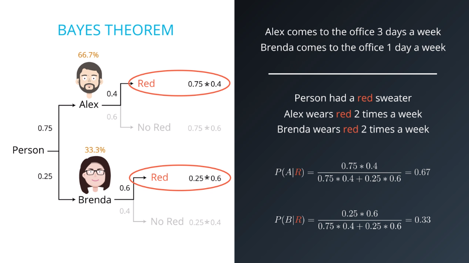
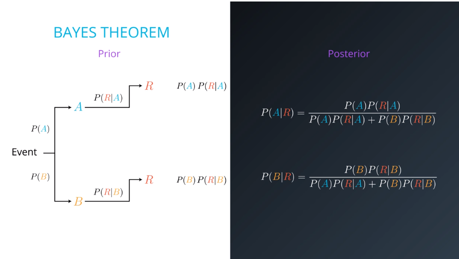

# Bayes Theorem

describes the [probability](https://en.wikipedia.org/wiki/Probability "Probability") of an [event](https://en.wikipedia.org/wiki/Event_(probability_theory)) "Event (probability theory)"), based on prior knowledge of conditions that might be related to the event

## General formula

